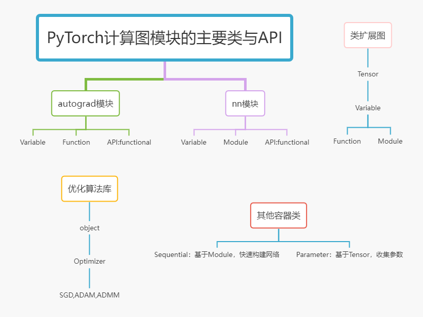

边学边总结，更新页面见 [Github](https://hfut-zyw.github.io/Pytorch-Tutorial/)  
访问我的主页地址 [Homepage](https://hfut-zyw.github.io/) 



## Pytorch的核心模块说明

- Pytorch两大主要功能：计算图构建与反向传播，优化 
- 计算图构建与反向传播实现方案：基于Tensor类扩充各种operator，每个operator实现forward和backward方法 
- 优化器的实现方案：基于object提供各种优化器类

### autograd模块 
- 首先基于Tensor扩充为Variable类，实现基本的加减乘除算子操作和反向传播（最新的torch已经不区分Variable和Tensor了） 
- 基于Variable扩充为Function类，实现更为复杂的函数的前向传播和反向传播 
- 上述实现操作和反向传播方法的时候需要调用functional中的API，而functional中的API又是调用C++的底层实现

### nn模块 
- 基于Variable（也可能是Function类）扩充为Module类，作为各种Layer和Loss的基类 
- 基于Module扩充为各种Layer和Loss，实现神经单元的前向传播和反向传播算法
- 上述实现操作和反向传播方法的时候需要调用functional中的API

### optim模块 
- 基于object定义Optimizer类，作为所有优化器的基类 
- 基于Optimizer实现各种优化器，SGD,ADAD,ADMM等  

### 计算图与优化器的交互 
- 对于基础模块autograd，只能将Variable节点传递给优化器 
- 对于nn模块，Module提供了parameter方法收集Variable参数，并传递给优化器
- parameter方法使用了Parameter容器类来存储参数，Parameter类是Tensor的子类。也是一个Variable节点，但是不参与计算图构建，不需要实现forward和backward方法

--- 
---

# <a id="Top">目录</a>

* <a href="#Tensor">*矩阵(Tensor)*</a>
   * <a href="#Tensor0">矩阵类型</a>
   * <a href="#Tensor1">矩阵创建</a>
   * <a href="#Tensor2">矩阵切片</a>
   * <a href="#Tensor2a">简单运算</a>
   * <a href="#Tensor2b">统计方法</a>
   * <a href="#Tensor3">矩阵变形</a>
   * <a href="#Autograd">自动求导</a>
   * <a href="#GPU">GPU</a>
* <a href="#Dataset/DataLoader">*数据集(Dataset/DataLoader)*</a>
* <a href="#Loss-function">*损失函数(Loss-function)*</a>
* <a href="#Optimizer">*优化器(Optimizer)*</a>
* <a href="#Model">*模型搭建(Model)*</a>
* <a href="#Train/Test">*训练/测试(Train/Test)*</a>
* <a href="#Visualization">*可视化(Visualization)*</a>

## <a id="Tensor">*矩阵(Tensor)*</a>


```python
import numpy as np
import torch
```

### <a id="Tensor0">矩阵类型</a> 
* Pytorch中定义了8种CPU张量类型和对应的GPU张量类型  
  
* torch.Tensor()、torch.rand()、torch.randn() 均默认生成 torch.FloatTensor型  
  
* 相同数据类型的tensor才能做运算


|    数据类型    |            dytpe            |        CPU         |           GPU           |
| :------------: | :-------------------------: | :----------------: | :---------------------: |
|   16位浮点型   |             //              |         //         |           //            |
|   32位浮点型   | torch.float32或torch.float  | torch.FloatTensor  | torch.cuda.FloatTensor  |
|   64位浮点型   | torch.float64或torch.double | torch.DoubleTensor | torch.cuda.DoubleTensor |
|                |                             |                    |                         |
| 8位无符号整型  |         torch.uint8         |         //         |           //            |
| 8位有符号整型  |         torch.int8          |         //         |           //            |
| 16位有符号整型 |         torch.int16         |         //         |           //            |
| 32位有符号整型 |         torch.int32         |         //         |           //            |
| 64位有符号整型 |         torch.int64         |         //         |           //            |


* 全局矩阵类型设置    
torch.set_default_tensor_type(torch.FloatTensor)  
  
* 数据类型转换  
在Tensor后加 .long(), .int(), .float(), .double()等即可，也可以用.to()函数进行转换，也可以在创建是填写dtype参数指定类型  

* 与numpy数据类型转换  
Tensor---->Numpy 使用 data.numpy()，data为Tensor变量  
Numpy ----> Tensor 使用 torch.from_numpy(data)，data为numpy变量  

* 与Python数据类型转换  
Tensor ----> 单个Python数据，使用data.item()，data为Tensor变量且只能为包含单个数据  
Tensor ----> Python list，使用data.tolist()，data为Tensor变量，返回shape相同的可嵌套的list  


### <a id="Tensor1">矩阵创建</a>

---

<font color=Red>从list,numpy创建</font>

- torch.tensor(),&emsp;torch.from_numpy()


```python
x=torch.tensor([[1,2,3,4],[2,3,4,5]],dtype=torch.int32)
y=torch.tensor([[1,2,3,4],[2,3,4,5]],dtype=torch.float32)
z=torch.from_numpy(np.array([[1,2,3,4],[2,3,4,5]]))
x,y,z
```


    (tensor([[1, 2, 3, 4],
             [2, 3, 4, 5]], dtype=torch.int32),
     tensor([[1., 2., 3., 4.],
             [2., 3., 4., 5.]]),
     tensor([[1, 2, 3, 4],
             [2, 3, 4, 5]], dtype=torch.int32))


---

<font color=Red>从函数创建</font>

 - <font color=MediumPurple >torch.empty(尺寸)&emsp;torch.full(尺寸,值)</font>   
   
 - <font color=MediumPurple >torch.zeros(尺寸)&emsp;torch.ones(尺寸)&emsp;torch.eye(维数)   </font> 
   
 - <font color=MediumPurple >torch.zeros_like(另一个矩阵)&emsp;torch.ones_like(另一个矩阵)  </font>   

note：尺寸可以是一维的，也可以是多维的，一般用列表框起来


```python
a1=torch.empty(3)
a2=torch.empty(3,2)
b=torch.eye(3)   
c1=torch.zeros(3)
c2=torch.zeros(2,3)
d=torch.ones([2,3])
e=torch.full([2,3],6)
f=torch.zeros_like(a1)
a1,a2,b,c1,c2,d,e,f
```


    (tensor([0., 0., 0.]),
     tensor([[1., 2.],
             [3., 4.],
             [2., 3.]]),
     tensor([[1., 0., 0.],
             [0., 1., 0.],
             [0., 0., 1.]]),
     tensor([0., 0., 0.]),
     tensor([[0., 0., 0.],
             [0., 0., 0.]]),
     tensor([[1., 1., 1.],
             [1., 1., 1.]]),
     tensor([[6, 6, 6],
             [6, 6, 6]]),
     tensor([0., 0., 0.]))


---

<font color=Red>区间内线性采样</font>

- <font color=MediumPurple >torch.arange(首，尾，可选步长) </font>   
note：不包括尾巴  
  
- <font color=MediumPurple >torch.linspace(首，尾，数量)  </font>  
note：包括尾巴，步长=(尾-首)/(n-1),因为starts+(n-1)step=end


```python
xx=torch.arange(5,8)
yy=torch.arange(5,8,2)
aa=torch.linspace(5,8,1)
bb=torch.linspace(5,8,10)
xx,yy,aa,bb
```


    (tensor([5, 6, 7]),
     tensor([5, 7]),
     tensor([5.]),
     tensor([5.0000, 5.3333, 5.6667, 6.0000, 6.3333, 6.6667, 7.0000, 7.3333, 7.6667,
             8.0000]))


---

<font color=Red >随机矩阵的创建</font>

- <font color=MediumPurple >torch.rand(尺寸)</font>  
均匀分布$U(0,1)$


```python
torch.rand(3),torch.rand(3,4)
```


    (tensor([0.2935, 0.9994, 0.5345]),
     tensor([[0.0848, 0.3584, 0.4169, 0.4182],
             [0.0722, 0.0683, 0.9621, 0.2453],
             [0.4179, 0.0489, 0.8421, 0.9037]]))


- <font color=MediumPurple > torch.randn(尺寸)，torch.normal(均值，方差，尺寸) </font>  
正态分布$N(0,1),N(u,\sigma^2)$


```python
torch.randn([3,4]),torch.normal(10,3,[3,4])
```


    (tensor([[-0.5733, -2.0242,  0.2901, -1.5611],
             [-1.1569, -0.0205,  0.3631,  0.9106],
             [-0.0216,  0.0631, -0.5662, -0.5790]]),
     tensor([[ 8.1374,  6.3413, 12.2465, 10.7367],
             [ 6.4856, 10.9087,  5.3544, 12.6686],
             [ 5.1848, 11.0438,  6.7981, 16.2792]]))


### <a id="Tensor2">矩阵切片</a>

### <a id="Tensor2a">简单运算</a>

### <a id="Tensor2b">统计方法</a>

### <a id="Tensor3">矩阵变形</a>

### <a id="Autograd">自动求导</a>

### <a id="GPU">GPU</a>

## <a id="Dataset/DataLoader">*数据集(Dataset/DataLoader)*</a>

## <a id="Loss-function">*损失函数(Loss-function)*</a>

## <a id="Optimizer">*优化器(Optimizer)*</a>

## <a id="Model">*模型搭建(Model)*</a>

## <a id="Train/Test">*训练/测试(Train/Test)*</a>

## <a id="Visualization">*可视化(Visualization)*</a>

<a href="#Top">To the top</a>
