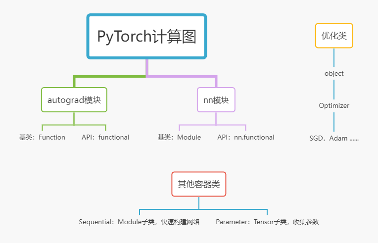

边学边总结，更新页面见 [Github](https://hfut-zyw.github.io/Pytorch-Tutorial/)  
访问我的主页地址 [Homepage](https://hfut-zyw.github.io/)

## Pytorch的核心模块说明

- Pytorch两大主要功能：计算图构建与反向传播，优化 
- 计算图构建与反向传播实现方案：定义一个基类，实现forward和backward方法，并且可以自动创建计算图，子类各种算子分别实现forward和backward；  
  自定义的算子或者网络如果使用已经有的算子进行forward，则不用定义backward
- 优化器的实现方案：基于object提供各种优化器类 
- [Pytorch源码](https://github.com/pytorch/pytorch/tree/master/torch)



### autograd模块 
- [doc](https://pytorch.org/docs/stable/autograd.html)
- 定义Function类，作为复杂的算子的基类；需要用户自己写更为复杂的算子，autograd中没有提供写好的算子包
- 上述实现操作和反向传播方法的时候需要调用functional中的API，而functional中的API又是调用C++的底层实现

### nn模块 
- [doc](https://pytorch.org/docs/stable/nn.html)
- 定义Module类，作为各种Layer和Loss的基类 
- 基于Module扩充为各种算子，Layer和Loss，实现神经单元的前向传播和反向传播算法
- 上述实现操作和反向传播方法的时候需要调用functional中的API

### optim模块 
- [doc](https://pytorch.org/docs/stable/optim.html)
- 基于object定义Optimizer类，作为所有优化器的基类 
- 基于Optimizer实现各种优化器，SGD,Adam等  

### 计算图与优化器的交互 
- 对于nn模块，Module提供了parameter方法收集参数（Tensor类），并传递给优化器
- parameter方法使用了Parameter容器类来存储参数，Parameter类是Tensor的子类，但是不参与计算图构建，不需要实现forward和backward方法

### Homework 1
- 基于Function写出exp（）算子 
- 使用autograd提供的Variable，Function构建一个简单的神经网络 
- 对某个叶子节点参数进行优化 
### Homeworak 2
- 基于Module写出一个简单的神经元 
- 使用nn模块提供的Module，各种Layer构建一个简单的神经网络
- 对神经网络的所有参数进行优化 
### Homeworak 3
- 在Homework2的基础上基于Module模块看懂Transformer论文源码 
[Transformer](https://github.com/jadore801120/attention-is-all-you-need-pytorch/tree/master/transformer)  
### 算子实现参考邱锡鹏《神经网络与深度学习：案例与实践》

---
---

# <a id="Top">目录</a>


* <a href="#Tensor">*矩阵(Tensor)*</a>
   * <a href="#Tensor0">1.矩阵类型</a>
   * <a href="#Tensor1">2.矩阵创建</a>
   * <a href="#Tensor2">3.矩阵切片</a>
   * <a href="#Tensor3">4.矩阵运算</a>
   * <a href="#Tensor4">5.矩阵变形</a>
   * <a href="#Tensor5">6.求和均值方差</a>
   * <a href="#Autograd">7.自动求导</a>
   * <a href="#GPU">8.GPU的使用</a>
* <a href="#Dataset/DataLoader">*数据集(Dataset/DataLoader)*</a>
* <a href="#Loss-function">*损失函数(Loss-function)*</a>
* <a href="#Optimizer">*优化器(Optimizer)*</a>
* <a href="#Model">*模型搭建(Model)*</a>
* <a href="#Train/Test">*训练/测试(Train/Test)*</a>
* <a href="#Visualization">*可视化(Visualization)*</a>


```python
import numpy as np
import torch
```

---
---

## <a id="Tensor">*矩阵(Tensor)*</a>

---

### <a id="Tensor0">1.矩阵类型</a> 
* Pytorch中定义了8种CPU张量类型和对应的GPU张量类型  
* 相同数据类型的tensor才能做运算
* 全局矩阵类型设置    
    - torch.set_default_tensor_type(torch.FloatTensor)   
* 数据类型转换  
    - 1.Tensor.long() ,  .int() ,  .float() ,  .double()   
    - 2.Tensor.to()   
    - 3.dtype='torch.float32'
* 与numpy数据类型转换  
    - Tensor--> Numpy ：Tensor.numpy()
    - Numpy --> Tensor ：torch.from_numpy()
* 与Python数据类型转换  
    - Tensor --> list：data.tolist()


|    数据类型    |            dytpe            |        CPU         |           GPU           |
| :------------: | :-------------------------: | :----------------: | :---------------------: |
|   16位浮点型   |             //              |         //         |           //            |
|   32位浮点型   | torch.float32或torch.float  | torch.FloatTensor  | torch.cuda.FloatTensor  |
|   64位浮点型   | torch.float64或torch.double | torch.DoubleTensor | torch.cuda.DoubleTensor |
|                |                             |                    |                         |
| 8位无符号整型  |         torch.uint8         |         //         |           //            |
| 8位有符号整型  |         torch.int8          |         //         |           //            |
| 16位有符号整型 |         torch.int16         |         //         |           //            |
| 32位有符号整型 |         torch.int32         |         //         |           //            |
| 64位有符号整型 |         torch.int64         |         //         |           //            |


---

### <a id="Tensor1">2.矩阵创建</a>

<font color=pink>一、从list,numpy创建</font>  
- torch.tensor(),&emsp;torch.from_numpy()


```python
x=torch.tensor([[1,2,3,4],[2,3,4,5]],dtype=torch.int32)
y=torch.tensor([[1,2,3,4],[2,3,4,5]],dtype=torch.float32)
z=torch.from_numpy(np.array([[1,2,3,4],[2,3,4,5]]))
x,y,z
```


    (tensor([[1, 2, 3, 4],
             [2, 3, 4, 5]], dtype=torch.int32),
     tensor([[1., 2., 3., 4.],
             [2., 3., 4., 5.]]),
     tensor([[1, 2, 3, 4],
             [2, 3, 4, 5]], dtype=torch.int32))


<font color=pink>二、从常见函数创建</font>  
 - <font color=MediumPurple >torch.empty(尺寸)&emsp;torch.full(尺寸,值)</font>   
   
 - <font color=MediumPurple >torch.zeros(尺寸)&emsp;torch.ones(尺寸)&emsp;torch.eye(维数)   </font> 
   
 - <font color=MediumPurple >torch.zeros_like(另一个矩阵)&emsp;torch.ones_like(另一个矩阵)  </font>   

note：尺寸可以是一维的，也可以是多维的，一般用列表框起来


```python
a1=torch.empty(3)
a2=torch.empty(3,2)
a3=torch.eye(3)   
a4=torch.zeros(3)
a5=torch.zeros(2,3)
a6=torch.ones([2,3])
a7=torch.full([2,3],6)
a8=torch.zeros_like(a1)
a1,a2,a3,a4,a5,a6,a7,a8
```


    (tensor([9.1477e-41, 0.0000e+00, 4.4842e-44]),
     tensor([[1., 2.],
             [3., 4.],
             [2., 3.]]),
     tensor([[1., 0., 0.],
             [0., 1., 0.],
             [0., 0., 1.]]),
     tensor([0., 0., 0.]),
     tensor([[0., 0., 0.],
             [0., 0., 0.]]),
     tensor([[1., 1., 1.],
             [1., 1., 1.]]),
     tensor([[6, 6, 6],
             [6, 6, 6]]),
     tensor([0., 0., 0.]))


<font color=pink>三、区间线性采样</font>  
- <font color=MediumPurple >torch.arange(首，尾，可选步长) </font>   
  note：不包括尾巴  
  
- <font color=MediumPurple >torch.linspace(首，尾，数量)  </font>  
note：包括尾巴，步长=(尾-首)/(n-1),因为starts+(n-1)step=end


```python
a=torch.arange(5,8)
b=torch.arange(5,8,2)
c=torch.linspace(5,8,1)
d=torch.linspace(5,8,10)
a,b,c,d
```


    (tensor([5, 6, 7]),
     tensor([5, 7]),
     tensor([5.]),
     tensor([5.0000, 5.3333, 5.6667, 6.0000, 6.3333, 6.6667, 7.0000, 7.3333, 7.6667,
             8.0000]))


<font color=pink >四、一些常见随机矩阵生成</font>  
- <font color=MediumPurple >torch.rand(尺寸)</font>  
均匀分布$U(0,1)$  
- <font color=MediumPurple >torch.randint(low,high,尺寸)</font>  
均匀分布$U(low,high)$  
- <font color=MediumPurple > torch.randn(尺寸) </font>  
正态分布$N(0,1)$  
- <font color=MediumPurple > torch.normal(均值，方差，尺寸) </font>  
正态分布$N(u,\sigma^2)$  


```python
x=torch.rand(2,3)  
y=torch.randint(1,9,[2,3])
a=torch.randn([3,4])
b=torch.normal(10,3,[3,4])
x,y,a,b
```


    (tensor([[0.7697, 0.3093, 0.2239],
             [0.9295, 0.6902, 0.0886]]),
     tensor([[1, 2, 8],
             [6, 7, 8]]),
     tensor([[-0.3317, -1.4514,  0.6665,  0.7765],
             [ 1.0954, -0.3389, -0.8067, -1.3568],
             [-1.6465, -1.8853, -1.8286,  0.0149]]),
     tensor([[16.8522, 11.1349,  7.1411, 16.0858],
             [15.2712,  7.4130,  8.6740, 12.8134],
             [ 9.0616,  6.4860, 10.2000,  9.6383]]))


---

### <a id="Tensor2">3.矩阵切片</a>  
- 逗号   
    - 逗号前表示行，逗号后表示列       
- 冒号 
    - 一个冒号&nbsp;start ：end  &nbsp;&nbsp;&nbsp;
    - 两个冒号&nbsp;start ：end ：step  &nbsp;&nbsp;&nbsp;

<font color=pink>一、1维矩阵的切片</font>  
- 同列表切片


```python
torch.random.seed()
a=torch.rand(10) 
a,a[5],a[0:3],a[:6],a[:-1]
```


    (tensor([0.1226, 0.7973, 0.4854, 0.7224, 0.8433, 0.7793, 0.4325, 0.8004, 0.7140,
             0.0311]),
     tensor(0.7793),
     tensor([0.1226, 0.7973, 0.4854]),
     tensor([0.1226, 0.7973, 0.4854, 0.7224, 0.8433, 0.7793]),
     tensor([0.1226, 0.7973, 0.4854, 0.7224, 0.8433, 0.7793, 0.4325, 0.8004, 0.7140]))


<font color=pink>二、2维矩阵的切片</font>


```python
a=torch.rand([6,4])
a
```


    tensor([[0.6353, 0.8920, 0.9199, 0.4035],
            [0.6945, 0.6330, 0.9331, 0.8373],
            [0.3548, 0.9944, 0.9018, 0.9718],
            [0.2909, 0.1973, 0.9949, 0.4955],
            [0.9215, 0.6109, 0.3772, 0.4395],
            [0.1501, 0.8836, 0.3299, 0.1494]])


```python
a[0],a[0:2],a[0:-1:2],a[[0,2]]  #取指定行
```


    (tensor([0.6353, 0.8920, 0.9199, 0.4035]),
     tensor([[0.6353, 0.8920, 0.9199, 0.4035],
             [0.6945, 0.6330, 0.9331, 0.8373]]),
     tensor([[0.6353, 0.8920, 0.9199, 0.4035],
             [0.3548, 0.9944, 0.9018, 0.9718],
             [0.9215, 0.6109, 0.3772, 0.4395]]),
     tensor([[0.6353, 0.8920, 0.9199, 0.4035],
             [0.3548, 0.9944, 0.9018, 0.9718]]))


```python
a[:,0]  #取指定列
```


    tensor([0.6353, 0.6945, 0.3548, 0.2909, 0.9215, 0.1501])


```python
a[0:2,-1]  #取任意元素
```


    tensor([0.4035, 0.8373])


---

### <a id="Tensor3">4.矩阵运算</a>

- 加减乘除：按元素 
    - $a+b=torch.add(a,b)$  
    - $a-b=torch.sub(a,b)$  
    - $a*b=torch.multiply(a,b)$  
    - $a/b=torch.div(a,b)$  
    &nbsp;   
- 加法的广播机制  
    - 维数一致：如shape=[3,5,8]和shape=[1,5,1],运算的结果为shape=[3,5,8]。
    - 维数不一致：如shape=[3,5,8和shape=[1,8],两个矩阵右对齐，然后维数少的左边补齐，[1,8]-->[1,1,8]，然后运算，结果shape=[3,5,8]  
    - 对比相应维数的长度时，如果不等，必须有一个为1才能进行广播，否则出错。如shape=[3,6]和shape=[2,6]无法运算  
    &nbsp; 
- 矩阵乘法  
    - x是一维行向量，y是一维行向量  
        - $torch.matmul(x,y)=xy^T$  
        - $torch.matmul(y,x)=yx^T$
    - x是一维行向量，W是二维矩阵  
        - $torch.matmul(W,x)=(Wx^T)^T$  
        - $torch.matmul(x,W)=xW$
    - A是矩阵，B是矩阵  
        - $torch.matmul(A,B)=AB$  
        - $torch.multiply(A,B)=A\cdot B$   
    - M.shape=[j,1,n,m]，N.shape=[k,m,p]：最后两个维度作矩阵乘法，其他维度进行广播机制  
        - [j,1]广播[k],就是[j,k],然后[n,m]与[m,p]作矩阵乘法，就是[n,p]，最终结果shape=[j,k,n,p]  
        - 实际情况，N有k个shape=[m,p]的矩阵，将M也变成k个shape=[n,m]的矩阵，作运算，最后复制为j份存到dim=0这一维  
        &nbsp;  
- 按批次运算1：若神经网络输入为一个D维的行向量x，输出为K维的行向量y：如 FNN，RNN   
    - x-->A，torch.matmul(x,W)-->torch.matmul(A,W)  
    - 输入输均由一个行向量，变成N个行向量，且乘法依然符合矩阵乘法  
    &nbsp;  
- 按批次运算2：若神经网络输入为一个LxD维的矩阵X，输出为LxD的矩阵O：如 CNN，Transformer   
    - X--> M，torch.matmul(X,W)-->torch.matmul(M,W)  
    - 输入输均由一排矩阵，变成N排矩阵，矩阵乘法为最后两维的矩阵乘法


<font color=pink>一、两个一维行向量相乘</font>


```python
x=torch.tensor([2,3])
y=torch.tensor([1,3])
a=torch.matmul(y,x)
b=torch.matmul(x.t(),y)
a,b
```


    (tensor(11), tensor(11))


<font color=pink>二、一维行向量左乘矩阵</font>


```python
x=torch.tensor([2,3])
y=torch.tensor([[1,2],[3,4]])
a=torch.matmul(x,y)
b=torch.matmul(x.t(),y)
a,b
```


    (tensor([11, 16]), tensor([11, 16]))


<font color=pink>三、一维行向量右乘矩阵</font>


```python
x=torch.tensor([2,3])
y=torch.tensor([[1,2],[3,4]])
a=torch.matmul(y,x)
b=torch.matmul(y,x.t())
a,b
```


    (tensor([ 8, 18]), tensor([ 8, 18]))


<font color=pink>四、矩阵相乘</font>


```python
x=torch.tensor([[2,3],[1,1],[3,8],[33,21]])    #shape=[4,2]
y=torch.tensor([[1,2,3],[4,5,6]])              #shape=[2,3]
a=torch.matmul(x,y)                            #shape=[4,3]
a

```


    tensor([[ 14,  19,  24],
            [  5,   7,   9],
            [ 35,  46,  57],
            [117, 171, 225]])


```python
x=torch.tensor([[[2,3],[1,1],[3,8],[33,21]],[[1,1],[1,1],[1,1],[1,1]]])    #shape=[2,4,2]
y=torch.tensor([[1,2,3],[4,5,6]])                                          #shape=[2,3]
a=torch.matmul(x,y)                                                        #shape=[2,4,3]，实际就是将x的每排shape=[4,2]的矩阵分别与矩阵y相乘
a
```


    tensor([[[ 14,  19,  24],
             [  5,   7,   9],
             [ 35,  46,  57],
             [117, 171, 225]],
    
            [[  5,   7,   9],
             [  5,   7,   9],
             [  5,   7,   9],
             [  5,   7,   9]]])


---

### <a id="Tensor4">5.矩阵变形</a>

<font color=pink >转置与变形：t()，reshape()</font>  
- torch.reshape(尺寸)  
    将矩阵拉平后，变成想要的尺寸  
- torch.flatten()  
    将矩阵拉平  
- torch.transpose(dim,dim)  
    指定维数进行转置，没指定的看成整体


```python
x=torch.tensor([[[1,2,3],[6,7,8]]])
x.shape,x.shape[1]
```


    (torch.Size([1, 2, 3]), 2)


```python
x.flatten()
```


    tensor([1, 2, 3, 6, 7, 8])


```python
x.reshape(1,3,-1)
```


    tensor([[[1, 2],
             [3, 6],
             [7, 8]]])


```python
x.transpose(1,2)
```


    tensor([[[1, 6],
             [2, 7],
             [3, 8]]])


```python
x.transpose(0,1)
```


    tensor([[[1, 2, 3]],
    
            [[6, 7, 8]]])


```python
torch.tensor([[1,2],[3,4]]).t()
```


    tensor([[1, 3],
            [2, 4]])


<font color=pink >分割：chunk()</font>

- torch.chunk(块，dim)  
    - 在指定维数将矩阵分成相应的块数


```python
torch.tensor([1,2,3,4,5,6,7,8,9]).chunk(3,0)                 #包含9个元素，分成3块
```


    (tensor([1, 2, 3]), tensor([4, 5, 6]), tensor([7, 8, 9]))


```python
x=torch.tensor([[[1,2,3],[4,5,6]],[[7,8,9],[3,7,0]]])        #第0维包含2个元素(矩阵)，第1维包含2行向量，第2维包含3个元素 
x.chunk(2,0)                                                 #把第0维的两个矩阵分开，获得两个矩阵
```


    (tensor([[[1, 2, 3],
              [4, 5, 6]]]),
     tensor([[[7, 8, 9],
              [3, 7, 0]]]))


<font color=pink >拼接：cat()</font>
- torch.cat((a,b),dim)
    - dim=0，分别将第0维的元素看成整体，将它们拉平横向拼在一块
    - dim=1，分别将第1维的元素看成整体，将它们拉平横向拼在一块
    - dim=2，分别将第2维的元素看成整体，将它们拉平横向拼在一块


```python
a,b=x.chunk(2,0)                                           #将x分成两块，用a，b接收   
a,b
```


    (tensor([[[1, 2, 3],
              [4, 5, 6]]]),
     tensor([[[7, 8, 9],
              [3, 7, 0]]]))


```python
torch.cat((a,b),0)                                         #按第0维拼接，第0维的元素是矩阵，所以获得所有矩阵的拼接
```


    tensor([[[1, 2, 3],
             [4, 5, 6]],
    
            [[7, 8, 9],
             [3, 7, 0]]])


```python
torch.cat((a,b),1)                                          #按第1维拼接，第1维是行向量，所以获得所有行向量的拼接
```


    tensor([[[1, 2, 3],
             [4, 5, 6],
             [7, 8, 9],
             [3, 7, 0]]])


<font color=pink >堆叠：stack()</font>
- torch.stack((a,b),dim)
    - 首先把每个矩阵最外层扩展一个维度，也就是加个方括号
    - dim=0，分别将第0维的元素看成整体，将它们拉平并罗列放置
    - dim=1，分别将第1维的元素看成整体，将它们拉平并罗列放置


```python
A = torch.tensor([[1, 2, 3],
                  [4, 5, 6],
        	      [7, 8, 9]])
B = torch.tensor([[12, 22, 33],
        	      [44, 55, 66],
                  [77, 88,99]])
A,B
```


    (tensor([[1, 2, 3],
             [4, 5, 6],
             [7, 8, 9]]),
     tensor([[12, 22, 33],
             [44, 55, 66],
             [77, 88, 99]]))


```python
torch.stack((A,B))                            #第一步，最外围加个方括号，增加一维；第二步，按dim=0堆叠，也就是将多个矩阵堆叠，获得多排矩阵
```


    tensor([[[ 1,  2,  3],
             [ 4,  5,  6],
             [ 7,  8,  9]],
    
            [[12, 22, 33],
             [44, 55, 66],
             [77, 88, 99]]])


```python
torch.stack((A,B),dim=1)                      #第一步，最外围加个方括号，增加一维；第二步，按dim=1堆叠，分别将行向量堆叠，分别获得一个矩阵，再把这些矩阵罗列放在一个列表中国
```


    tensor([[[ 1,  2,  3],
             [12, 22, 33]],
    
            [[ 4,  5,  6],
             [44, 55, 66]],
    
            [[ 7,  8,  9],
             [77, 88, 99]]])


<font color=pink >拼接与堆叠的应用：合并样本与样本的特征</font>
- To be continued...

<font color=pink >squeeze()与unsqueeze()</font>
- torch.squeeze() 
    - 删除所有维数为1的维度  
- torch.squeeze(dim) 
    - 删除指定维度为1的维度，其实就是去掉指定维数的括号  
- torch.unsqueeze(dim) 
    - 在指定的地方增加一个维数，假如原本是个二维矩阵 
    - dim=0,   &nbsp;最外层加一个括号 
    - dim=1,   &nbsp;对第1层每个元素，也就是每个行向量，分别加个括号
    - dim=2,   &nbsp;对第2层每个元素，也就是每个数值，分别加个括号
    


```python
x=torch.tensor([[[1],[2],[3]],[[4],[5],[6]]])
x.squeeze(2)
```


    tensor([[1, 2, 3],
            [4, 5, 6]])


```python
y=x.squeeze(2)
y,y.unsqueeze(1)
```


    (tensor([[1, 2, 3],
             [4, 5, 6]]),
     tensor([[[1, 2, 3]],
     
             [[4, 5, 6]]]))


<font color=pink >关于维度的小结  </font>   
    - [[[ &nbsp;分别看作第0，1，2维的墙  
    - 如果对第0维进行操作，比如sum，mean，min的操作，那么进入第0维房间，把里面的元素看成整体，进行操作，操作后只改变第0维的维数  
    - 如果是增加维数（墙面），按指定的位置增加墙面即可，如squeeze和unsqueeze

---

### <a id="Tensor5">6.求和均值方差</a>

- torch.sum() &nbsp; torch.mean() &nbsp; torch.var() &nbsp; torch.std()  
    - 对全部元素求和,均值，方差，标准差  
- torch.sum(dim) &nbsp; torch.mean(dim) &nbsp; torch.var(dim) &nbsp; torch.std(dim)
    - 进入指定的维数房间，对里面的元素进行求和，均值，方差，标准差


```python
x=torch.tensor([[1,2,3],[4,5,6]])
x,x.sum(dim=0),x.sum(dim=1)
```


    (tensor([[1, 2, 3],
             [4, 5, 6]]),
     tensor([5, 7, 9]),
     tensor([ 6, 15]))


---

### <a id="Autograd">7.自动求导</a>

[PaddlePaddle](https://aistudio.baidu.com/aistudio/projectdetail/2528424)  
[Youtube1](https://www.youtube.com/watch?v=R_m4kanPy6Q)  
[Youtube2](https://www.youtube.com/watch?v=MswxJw-8PvE)  
[Youtube3](https://www.youtube.com/watch?v=ALMKFS_QFm4)

<font color=pink >基本概念</font>
- 这里仅讨论标量对参数的求导，梯度与参数矩阵形状一致，表示每个参数动一动，标量的变化  
- 被求导的变量，需要设置requires_grad=True，dtype=torch.float32  
- 求导的梯度，在参数的grad属性中保存


```python
a=torch.ones([2,3],dtype=torch.float32,requires_grad=True)
b=a.sum()
b.backward()
print(a.grad)
```

    tensor([[1., 1., 1.],
            [1., 1., 1.]])


<font color=pink >梯度的累加</font>  
- 梯度每次计算都会被累加在grad属性中  
- 使用torch.grad.zero_()方法可以进行梯度归零  


```python
a=torch.ones([2,3],dtype=torch.float32,requires_grad=True)
for i in range(3):
    b=a.sum()
    b.backward()
    print(a.grad)
a.grad.zero_()
print(a.grad)
```

    tensor([[1., 1., 1.],
            [1., 1., 1.]])
    tensor([[2., 2., 2.],
            [2., 2., 2.]])
    tensor([[3., 3., 3.],
            [3., 3., 3.]])
    tensor([[0., 0., 0.],
            [0., 0., 0.]])


<font color=pink >计算图的构建与销毁</font>  
- 每次进行前向计算时都会自动构建计算图，调用backward后自动销毁  
- 在调用backward方法的时候设置retain_graph=True，计算图可保留，不用再次前向计算


```python
a=torch.ones([2,3],dtype=torch.float32,requires_grad=True)
b=a.sum()
b.backward(retain_graph=True) #计算图保留，相当于对计算图什么也没做，就求了一次梯度
print(a.grad)
b.backward() #调用后自动销毁计算图
print(a.grad)
```

    tensor([[1., 1., 1.],
            [1., 1., 1.]])
    tensor([[2., 2., 2.],
            [2., 2., 2.]])


<font color=pink >不构建计算图</font>  
- 前向计算时，构建正向计算图的同时，会通过回溯的方式，构建反向算子与反向计算图  
- 可以通过查看grad_fn属性查看有没有构建反向算子
- with torch.no_grad(): 后面的计算，不会构建计算图  


```python
a=torch.tensor(2.0,requires_grad=True)
f=2*a                                  #f参与构建计算图
g=3*b                                  #g参与构建计算图
with torch.no_grad():
    f=3*a                              #f重新定义，不构建计算图
print(f.grad_fn,g.grad_fn)
```

    None <MulBackward0 object at 0x000001E4035A2E50>


<font color=pink >将变量变成常量</font>  
- a.detach()返回一个张量，data区就是a的data区，requires_grad=False  
- 可以用out来接收，输入到下一个网络中，并且作为常量传入的，不参与梯度计算  
- 由于是新创建的张量，不影响原来的计算图 ；但是不要用同一个变量名接收这个张量，否则计算图中的那个变量名就没了 
- 固定网络A的参数，更新网络B的参数的方法  
    - 方法一：将网络A的输入detach一下，创建新的标量张量作为网络B的输入，这时候只会构建B网络的计算图  
    - 方法二：用for遍历A网络的参数，将requires_grad属性全部设为False  
- 一个不常用的torch.detach_()操作，原地修改计算图，有点复杂，实际上所有的tensor操作后加个下划线都是原地操作 


```python
a=torch.tensor(2.0,requires_grad=True)
b=a.detach()
a,b
```


    (tensor(2., requires_grad=True), tensor(2.))


---

### <a id="GPU">8.GPU的使用</a>

- 这里仅使用一块gpu
- 查看设备是否可用：torch.cuda.is_available()查看设备
- 指定设备：device = torch.device(“cuda:0”)或device = torch.device( “cpu”)或device = torch.device(“cuda:0”  if torch.cuda.is_available() else “cpu”)
- 使用tensor.to(device)和model.to(tensor)把输入张量和模型参数送进gpu，这样计算图便在gpu中构建了；使用.device可以查看设备属性


```python
torch.cuda.is_available(),torch.tensor(2.0).device
```


    (False, device(type='cpu'))


---

### 综合案例1：  
采集两个圆上的点数据，x作为一个特征，y作为一个特征，每个圆各采集5个样本，最后合并成10个样本，每个样本有2个特征


```python
import paddle
import math
n_samples = 10
n_samples_out = n_samples // 2
n_samples_in = n_samples - n_samples_out

# 采集第1类数据，特征为(x,y)
# 使用'paddle.linspace'在0到pi上均匀取n_samples_out个值
# 使用'paddle.cos'计算上述取值的余弦值作为特征1，使用'paddle.sin'计算上述取值的正弦值作为特征2
outer_circ_x = paddle.cos(paddle.linspace(0, math.pi, n_samples_out))
outer_circ_y = paddle.sin(paddle.linspace(0, math.pi, n_samples_out))

inner_circ_x = 1 - paddle.cos(paddle.linspace(0, math.pi, n_samples_in))
inner_circ_y = 0.5 - paddle.sin(paddle.linspace(0, math.pi, n_samples_in))

print('outer_circ_x.shape:', outer_circ_x.shape,'\n',
      'outer_circ_y.shape:', outer_circ_y.shape)
print('inner_circ_x.shape:', inner_circ_x.shape,'\n',
      'inner_circ_y.shape:', inner_circ_y.shape)
print('outer_circ_x:', outer_circ_x,'\n',
      'outer_circ_y:', outer_circ_y)
print('inner_circ_x:', inner_circ_x,'\n',
      'inner_circ_y:', inner_circ_y)

# 使用'paddle.concat'将两类数据的特征1和特征2分别延维度0拼接在一起，得到全部特征1和特征2
# 使用'paddle.stack'将两类特征延维度1堆叠在一起
X = paddle.stack(
    [paddle.concat([outer_circ_x, inner_circ_x]),
     paddle.concat([outer_circ_y, inner_circ_y])],
    axis=1
)

print('after concat shape:', paddle.concat(
    [outer_circ_x, inner_circ_x]).shape)
print('X shape:', X.shape)
print('after concat :', paddle.concat(
    [outer_circ_x, inner_circ_x]))
print('X :', X)
# 使用'paddle. zeros'将第一类数据的标签全部设置为0
# 使用'paddle. ones'将第一类数据的标签全部设置为1
y = paddle.concat(
    [paddle.zeros(shape=[n_samples_out]),
     paddle.ones(shape=[n_samples_in])]
)

print('y shape:', y.shape)
print('y :', y)
```

    outer_circ_x.shape: [5] 
     outer_circ_y.shape: [5]
    inner_circ_x.shape: [5] 
     inner_circ_y.shape: [5]
    outer_circ_x: Tensor(shape=[5], dtype=float32, place=Place(cpu), stop_gradient=True,
           [ 1.        ,  0.70710677, -0.00000004, -0.70710683, -1.        ]) 
     outer_circ_y: Tensor(shape=[5], dtype=float32, place=Place(cpu), stop_gradient=True,
           [ 0.        ,  0.70710683,  1.        ,  0.70710683, -0.00000009])
    inner_circ_x: Tensor(shape=[5], dtype=float32, place=Place(cpu), stop_gradient=True,
           [0.        , 0.29289323, 1.        , 1.70710683, 2.        ]) 
     inner_circ_y: Tensor(shape=[5], dtype=float32, place=Place(cpu), stop_gradient=True,
           [ 0.50000000, -0.20710683, -0.50000000, -0.20710683,  0.50000006])
    after concat shape: [10]
    X shape: [10, 2]
    after concat : Tensor(shape=[10], dtype=float32, place=Place(cpu), stop_gradient=True,
           [ 1.        ,  0.70710677, -0.00000004, -0.70710683, -1.        ,
             0.        ,  0.29289323,  1.        ,  1.70710683,  2.        ])
    X : Tensor(shape=[10, 2], dtype=float32, place=Place(cpu), stop_gradient=True,
           [[ 1.        ,  0.        ],
            [ 0.70710677,  0.70710683],
            [-0.00000004,  1.        ],
            [-0.70710683,  0.70710683],
            [-1.        , -0.00000009],
            [ 0.        ,  0.50000000],
            [ 0.29289323, -0.20710683],
            [ 1.        , -0.50000000],
            [ 1.70710683, -0.20710683],
            [ 2.        ,  0.50000006]])
    y shape: [10]
    y : Tensor(shape=[10], dtype=float32, place=Place(cpu), stop_gradient=True,
           [0., 0., 0., 0., 0., 1., 1., 1., 1., 1.])


---

### 综合案例2：分类任务的准确率计算  
    - 二分类任务imputs为NxD，labels为Nx1，outputs为Nx1  
    - 多分类任务imputs为NxD，labels为Nx1，outputs为NxC


```python
def accuracy(preds, labels):
    """
    输入：
        - preds：预测值，二分类时，shape=[N, 1]，N为样本数量，多分类时，shape=[N, C]，C为类别数量
        - labels：真实标签，shape=[N, 1]
    输出：
        - 准确率：shape=[1]
    """
    # 判断是二分类任务还是多分类任务，preds.shape[1]=1时为二分类任务，preds.shape[1]>1时为多分类任务
    if preds.shape[1] == 1:
        # 二分类时，判断每个概率值是否大于0.5，当大于0.5时，类别为1，否则类别为0
        # 使用'paddle.cast'将preds的数据类型转换为float32类型
        preds = paddle.cast((preds>=0.5),dtype='float32')
    else:
        # 多分类时，使用'paddle.argmax'计算最大元素索引作为类别
        preds = paddle.argmax(preds,axis=1, dtype='int32')
    return paddle.mean(paddle.cast(paddle.equal(preds, labels),dtype='float32'))

# 假设模型的预测值为[[0.],[1.],[1.],[0.]]，真实类别为[[1.],[1.],[0.],[0.]]，计算准确率
preds = paddle.to_tensor([[0.],[1.],[1.],[0.]])
labels = paddle.to_tensor([[1.],[1.],[0.],[0.]])
print("accuracy is:", accuracy(preds, labels))
```

    accuracy is: Tensor(shape=[1], dtype=float32, place=Place(cpu), stop_gradient=True,
           [0.50000000])


---

### 综合案例3：Simple RNN（了解矩阵行向量左乘矩阵以及一个批次的行向量左乘矩阵）  

#### 输入与输出分析  
- inputs：3维矩阵，如shape=[3，4，8]，表示3个batch（3个句子），每个句子包含4个单词，每个单词是一个8维向量  
- 中间层计算（1）：先分析一个句子的情况，并且忽略记忆单元。第一个词进去，出来一个词，第二个词进去，出来一个词，依次进行到最后一个词进去，出来一个词，把最后出来的词作为输出  
- 中间层计算（2）：由于神经网络一次性并行计算一个batch的样本，如一个batch包含5句话，那么将5句话的第一个词是一个矩阵，每一行就是每句话的第一个词，那么每层输出都是一个矩阵，表示这5句话的第j个词对应的输出  
- 隐藏层：就是中间层的输出  
- outputs：就是最后一个词和隐藏层丢进网络的输出  
- 单次计算的本质：处理单个词，输出单个词；对于一个batch，输入多个并行的词，输出多个并行的词，并行的词来自不同的句子；对于一个句子的多个词，采用串行依次处理


```python
import paddle
import paddle.nn as nn
import paddle.nn.functional as F
paddle.seed(0)

# SRN模型
class SRN(nn.Layer):
    def __init__(self, input_size,  hidden_size, W_attr=None, U_attr=None, b_attr=None):
        super(SRN, self).__init__()
        # 嵌入向量的维度
        self.input_size = input_size
        # 隐状态的维度
        self.hidden_size = hidden_size
        # 定义模型参数W，其shape为 input_size x hidden_size
        self.W = paddle.create_parameter(shape=[input_size, hidden_size], dtype="float32", attr=W_attr)
        # 定义模型参数U，其shape为hidden_size x hidden_size
        self.U = paddle.create_parameter(shape=[hidden_size, hidden_size], dtype="float32",attr=U_attr)
        # 定义模型参数b，其shape为 1 x hidden_size
        self.b = paddle.create_parameter(shape=[1, hidden_size], dtype="float32", attr=b_attr)

    # 初始化向量
    def init_state(self, batch_size):
        hidden_state = paddle.zeros(shape=[batch_size, self.hidden_size], dtype="float32")
        return hidden_state

    # 定义前向计算
    def forward(self, inputs, hidden_state=None):
        # inputs: 输入数据, 其shape为batch_size x seq_len x input_size
        batch_size, seq_len, input_size = inputs.shape

        # 初始化起始状态的隐向量, 其shape为 batch_size x hidden_size
        if hidden_state is None:
            hidden_state = self.init_state(batch_size)

        # 循环执行RNN计算
        for step in range(seq_len):
            # 获取当前时刻的输入数据step_input, 其shape为 batch_size x input_size
            step_input = inputs[:, step, :]
            print(f'中间层的x:{step_input}','\n')
            # 获取当前时刻的隐状态向量hidden_state, 其shape为 batch_size x hidden_size
            hidden_state = F.tanh(paddle.matmul(step_input, self.W) + paddle.matmul(hidden_state, self.U) + self.b)
            print(f'中间层的h:{hidden_state}','\n')
        return hidden_state
```


```python
W_attr = paddle.ParamAttr(initializer=nn.initializer.Assign([[0.1, 0.2], [0.1,0.2]]))
U_attr = paddle.ParamAttr(initializer=nn.initializer.Assign([[0.0, 0.1], [0.1,0.0]]))
b_attr = paddle.ParamAttr(initializer=nn.initializer.Assign([[0.1, 0.1]]))

srn = SRN(2, 2, W_attr=W_attr, U_attr=U_attr, b_attr=b_attr)

inputs = paddle.to_tensor([[[1, 0],[0, 2]],[[2, 4],[1, 3]]], dtype="float32")
hidden_state = srn(inputs)
print("hidden_state", hidden_state)
```

    中间层的x:Tensor(shape=[2, 2], dtype=float32, place=Place(cpu), stop_gradient=True,
           [[1., 0.],
            [2., 4.]]) 
    
    中间层的h:Tensor(shape=[2, 2], dtype=float32, place=Place(cpu), stop_gradient=False,
           [[0.19737528, 0.29131261],
            [0.60436779, 0.86172318]]) 
    
    中间层的x:Tensor(shape=[2, 2], dtype=float32, place=Place(cpu), stop_gradient=True,
           [[0., 2.],
            [1., 3.]]) 
    
    中间层的h:Tensor(shape=[2, 2], dtype=float32, place=Place(cpu), stop_gradient=False,
           [[0.31773996, 0.47749743],
            [0.52713710, 0.74447167]]) 
    
    hidden_state Tensor(shape=[2, 2], dtype=float32, place=Place(cpu), stop_gradient=False,
           [[0.31773996, 0.47749743],
            [0.52713710, 0.74447167]])


---
---


## <a id="Dataset/DataLoader">*数据集(Dataset/DataLoader)*</a>

---
---


## <a id="Loss-function">*损失函数(Loss-function)*</a>

---
---


## <a id="Optimizer">*优化器(Optimizer)*</a>

---
---


## <a id="Model">*模型搭建(Model)*</a>

---
---


## <a id="Train/Test">*训练/测试(Train/Test)*</a>

---
---


## <a id="Visualization">*可视化(Visualization)*</a>

<a href="#Top">To the top</a>
